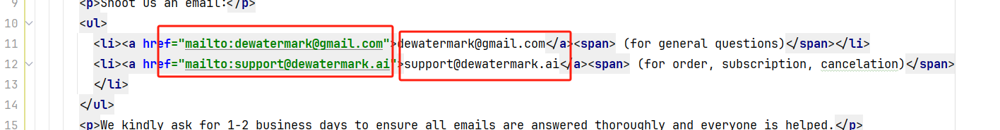

1、首页内容
  修改文字 两个路径下
  1) src/languages/modules/en.ts
  2) src/views/home/index.vue

2、首页图片
  1) 当用户没有图片时候需要点击的图片：
      src/assets/images/home/(1-8).png/jpg 需要注意下png还是jpg
  2) 下面其它模块图片： 
     src/views/home/index.vue 搜索图片地址修改
     侧身戴墨镜女孩（尺寸600*595） 	https://assets.dewatermark.ai/images/watermark-remover/new/howtouse_3.webp
     how to remove ****模块图片（尺寸1032*656） https://assets.dewatermark.ai/images/watermark-remover/new/featureComparison/before_1.webp
     explore our *** 模块三张图片（尺寸5444*308）
      https://assets.dewatermark.ai/images/watermark-remover/new/removeBgThumbnail.webp
      https://assets.dewatermark.ai/images/watermark-remover/new/upscaleThumbnail.webp
      https://assets.dewatermark.ai/images/watermark-remover/new/passportMakerThumbnail.webp

3、底部跳转地址 修改内容 需要注意事项
   1)Contact us 邮箱 这段文字 需要将每个li中两个地址都改成我们的
      <li><a href="mailto:dewatermark@gmail.com">dewatermark@gmail.com</a> (for general questions)</li>
      <li><a href="mailto:support@dewatermark.ai">support@dewatermark.ai</a> (for order, subscription, cancelation)
      
  
